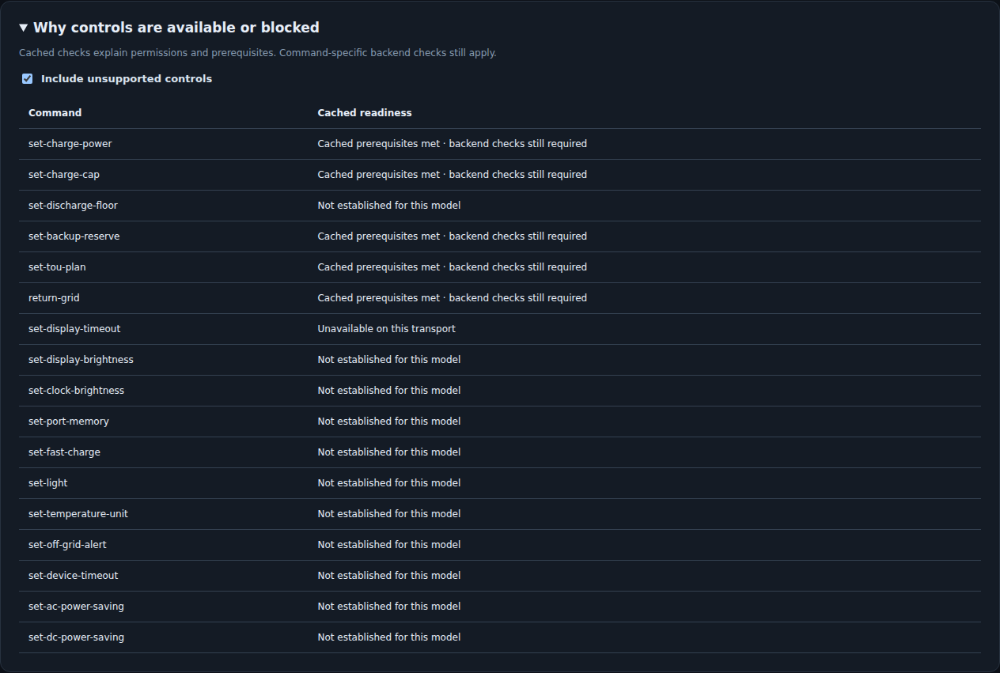
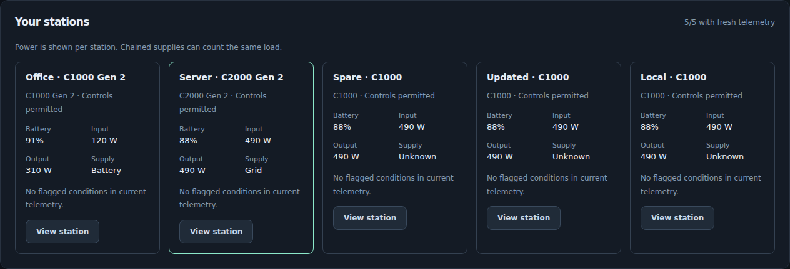

# Control explanations, fleet overview and coordinated HTTP writes

These source features use cached gateway status. They add no station queries,
pairing, firmware operations or automatic charging actions. Source verification
uses synthetic stations; the running deployment has not been changed.

## Explain unavailable controls

Every scoped device snapshot now includes `control_availability`. The same
report is available at `GET/HEAD /devices/{name}/control-availability`, including
on monitoring-only gateways. Each command has `advertised`, `permitted`, `ready`,
fixed `reasons` and `missing_metrics` field names. Permissions remain enforced by
the existing command allowlists; the report never adds commands to them.

The browser's **Why controls are available or blocked** panel explains model,
transport, gateway/worker enablement, token scope, freshness, missing settings,
known firmware prerequisites and a running HTTP command. Enable **Include
unsupported controls** to compare model and transport boundaries.



CLI and SDK readers send one cached GET, with bounded JSON validation and
identity/credential filtering:

```sh
solix-link control-availability --gateway-url http://127.0.0.1:8765 \
  --gateway-token-file /private/http-token --name office
```

`solix_link.gateway_client.GatewayClient.control_availability(name)` provides
the same read-only JSON contract. Its token file must be owner-only.

HA adds the diagnostic **Blocked controls** sensor when a gateway supplies a
valid report. Its value counts blocked controls established for the model and
configured transport; unsupported commands do not inflate the count. Attributes
contain all sanitized rows and mark `preflight_only` and
`backend_validation_required`. The sensor can explain unavailable telemetry
while the gateway remains reachable. It becomes unavailable if gateway polling
fails. It has no statistics/energy state class.

Readiness is advisory. A recent general packet does not prove every cached
setting was freshly queried. Value-dependent checks, ranges, preservation of
unreported raw settings, independently refreshed plans and actual device
responses still belong to command-specific backend validation. For example,
Fast-charge enablement has additional mode/mains requirements; its Off action
can have different prerequisites. A `ready` row is not a promise that either
action will execute or change electrical behavior.

C2000 native MQTT retains five control families: charging power, charge cap,
backup reserve, TOU and return to grid. Its BLE screen-timeout control is
reported as unavailable on native MQTT. C1000 Gen 2 native has sixteen families;
its firmware-specific preference evidence does not qualify the C2000.

## Fleet overview

The browser displays every station visible to the token, with per-station SOC,
input/output power, supply state, permission summary and existing reserve/mains
observations. Selecting a card opens that station's controls. Offline/stale
measurements display **Unknown**, and communication loss is not called a mains
outage. Missing measurements remain unknown rather than zero.



The panel consumes the existing device-list response. It does not total power
or energy: chained batteries can report the same load at multiple points.

## Coordinate commands

The HTTP gateway admits one executing command per station. A competing request
gets HTTP 409 `DeviceBusy` before execution; it is not queued. Different
stations can run independently. Even older clients without metadata receive
this serialization, but they do not gain expected-setting checks or replay
protection.

Snapshots include `command_context` with a random gateway-instance marker,
server `issued_at`, a 3,600-second request window, `busy` and sanitized
`expected` settings. The marker is not a station identity or authentication
credential. The browser captures this context when opening its confirmation
dialog. HA captures it from the fresh GET preceding its single POST.

A command body can add the following optional metadata to its existing fields:

```json
{
  "command": "set-charge-power",
  "watts": 500,
  "expected": {
    "model": "c1000_gen2",
    "protocol": "native_mqtt",
    "metrics": {"ac_charging_power_limit_w": 300}
  },
  "coordination": {
    "request_id": "synthetic-request-01",
    "gateway_instance": "COPY_THE_CURRENT_32_HEX_MARKER",
    "issued_at": 1791158400
  }
}
```

Use a new 16–64-character request ID containing ASCII letters, digits, `_` or
`-`; copy the marker/time from current server context. The above example is
illustrative, not a valid live ticket. Preconditions must contain a known
model/transport and only validated setting/power-state fields. Runtime SOC,
watts, identities and declining countdown values are not included. If a saved
TOU plan is included, its independent freshness and semantic content are
checked; its report timestamp is not compared for equality.

After reserving the station, the gateway checks expected values against fresh
cached status. A missing, changed or stale value returns 409
`PreconditionFailed` with `settings_may_have_changed: false`, without an
executor call. These checks are not atomic firmware compare-and-swap: direct
SDK/socket clients, the Anker app or the firmware itself can change a setting
after the cached comparison. Existing raw-state safety guards remain decisive.

## Lost responses and replay limits

`GET/HEAD /devices/{name}/command-results/{request_id}` looks up the current
token's record and never sends a station command. The browser's **Check recorded
result** button uses this route. It reports in-progress, finished or unavailable
records without resending a write. A different token cannot read the record,
even if it can monitor the same station.

Within the original ticket's window, an identical POST envelope returns its
recorded HTTP status/body with `coordination.replayed: true`, without execution
or another audit record. A changed payload, expected state or ticket with the
same ID gets `RequestIdConflict`. An in-progress duplicate gets
`CommandInProgress` and an unknown-change flag. Timeouts, cancellation and
unexpected executor errors retain their unknown outcome when replayed.

Do not refresh the ticket's timestamp or marker to retry an uncertain command.
Expired tickets and previous gateway instances are rejected. At most 4,096
request records are held in memory; active-window records are never evicted to
admit more writes. A full cache rejects new IDs until completed records expire.
Restart clears records, changes the marker and rejects old envelopes. A missing
record means unknown outcome, not proof the command was never sent.

Run one HTTP gateway process for each managed station set. Locks/history are
process-local and do not coordinate independent gateways, worker/socket callers
or a multi-worker ASGI deployment. The HA client and browser make one POST and
do not retry automatically. Cached confirmation/readback is not independent
physical or electrical verification.

## Certificate compatibility found during verification

Fresh AP initialization now gives CA and leaf certificates subject/authority
key identifiers and gives leaves explicit TLS key usage. Python 3.14's strict
client verification rejected the previous generated leaf chain with **Missing
Authority Key Identifier**. Synthetic mutual-TLS original-C1000 and shared-fleet
tests pass with the new generation; verification flags were not weakened.

This changes newly initialized profiles only. Existing certificate sets are
not regenerated or migrated. The live deployment has not been inspected or
changed. Device acceptance of the enlarged credential response remains a
future physical provisioning check; tests establish local TLS compatibility.
