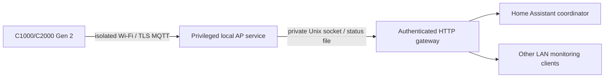

# Local gateway and Home Assistant

## Deployment layout

Run one station connection owner and let other machines use its HTTP API:



For BLE models, `serve` owns Bluetooth instead of `ap-service-run`/`ap-service-serve`. Do not
start both BLE owners for the same station. The separate gateway keeps AP
privileges and reconnection out of HA; HA uses one shared HTTP client/coordinator
as described in its [official fetching guidance](https://developers.home-assistant.io/docs/integration_fetching_data/).

## Start the native gateway

Install into a venv and complete [isolated AP setup](isolated-ap-mqtt.md).
Use absolute private directory paths and a dedicated unused AP adapter.

```sh
python3 -m pip install -e './python[server,mqtt,tui]'
sudo /path/to/venv/bin/solix-link ap-service-run \
  --directory /path/to/.solix-private/local-mqtt --allow-control
```

In another shell, load a generated token from an owner-only file:

```sh
export SOLIX_HTTP_TOKEN="$(cat /path/to/private/http-token)"
sudo --preserve-env=SOLIX_HTTP_TOKEN /path/to/venv/bin/solix-link ap-service-serve \
  --directory /path/to/.solix-private/local-mqtt \
  --host YOUR_LAN_ADDRESS --port 8765 --allow-control
```

The default bind is localhost. Both worker and HTTP gateway must explicitly
enable controls. HTTP control startup refuses an empty token. Every API endpoint
requires the token when configured. Add `--web-ui` for the optional
[Vue dashboard](web-dashboard.md); its public shell contains no station data.
The gateway uses FastAPI/Uvicorn and bundles its UI assets with Python. Protect the LAN connection or place a
trusted HTTPS proxy in front of it; the station remains in its isolated network.
For BLE, use `solix-link serve --config ... --allow-control` with the same token.

## Command API

GET `/diagnostics` explains cached availability with redacted, ordinal station
entries. Native gateways also offer GET `/setup-check` for saved profile and
certificate checks. Both use existing authentication and send no device request;
see [gateway diagnostics](gateway-diagnostics.md) and
[setup checks](ap-service-setup-check.md).

Read-only additions use the same Bearer token and work without `--allow-control`:

Use `--permissions-file` for separate monitoring/control tokens with explicit
device and command scopes. This replaces the environment token; all data
routes, metrics and SSE honor its read scopes. Optional UPS/activity persistence,
HA alerts, partial settings comparisons and audit limits are documented in
[UPS activity and permissions](ups-activity-and-permissions.md).

| Route | Purpose |
| --- | --- |
| `GET/HEAD /devices/{name}/control-availability` | Cached, scoped explanations for unavailable controls |
| `GET/HEAD /devices/{name}/command-results/{request_id}` | Current token's recorded HTTP outcome; never resends a command |
| `GET/HEAD /devices/{name}/activity?limit=100&after=0` | Bounded cached UPS/settings events and sanitized HTTP command results |
| `GET/HEAD /devices/{name}/settings-export` | Sanitized partial preferences; no restoration |
| `POST /devices/{name}/settings-compare` | Compare a supplied partial baseline against cached preferences; sends no commands |
| `POST /devices/{name}/charging-preview` | Evaluate a bounded manual price/export request against cached native Gen 2 telemetry; returns proposals with zero commands |
| `POST /devices/{name}/adaptive-preview` | Evaluate the separate surplus/price TOU contract against cached status; returns settings and candidate plans with no executor |
| `GET/HEAD /history` | Report optional recorder availability and bounded storage statistics |
| `GET/HEAD /devices/{name}/history?since=...&until=...&limit=1000` | Query saved readings and estimated AC energy/coverage; timestamps are Unix seconds |
| `GET/HEAD /devices/{name}/energy` | Cached native Gen 2 energy counters, nominal kWh and independent report freshness; `null` when unavailable |

HTTP writes are serialized per station. Optional `expected` and `coordination`
fields add cached precondition checks and restart-aware request deduplication;
the updated browser and HA client supply them. See
[command coordination](control-readiness-and-coordination.md) for envelopes,
fixed conflict codes, the one-hour memory window and single-process limits.

History is disabled unless `serve` or `ap-service-serve` receives
`--history-file /private/history/readings.sqlite3`; retention defaults to seven
days. See [history semantics](persistent-history.md) and
[preview schema and limits](charging-policy-preview.md) and
[adaptive contract](adaptive-policy-preview.md). These routes send no
station requests or enables the prepared HA charging automation.

Native energy uploads are distinct from power-integrated history. Station
snapshots and SSE include sanitized `native_energy`; `/metrics` also exposes
raw and unverified kWh gauges. Collection uses the AP worker's separate
`--energy-reports` opt-in. See [contract, persistence and units](native-energy-values.md).

GET `/devices` returns stations, freshness, `power_flow`, metrics and the
available `controls` and configured `timezone_name`.
A [shared AP](multiple-ap-devices.md) exposes each registered station through
these same endpoints. POST `/devices/{saved-name}/commands` accepts only the
advertised command schema. For example:

```json
{"command": "return-grid", "timeout": 30}
```

Send `Authorization: Bearer <token>` and `Content-Type: application/json`.
Other native commands: `set-charge-power`/`watts`, `set-charge-cap`/`upper`,
`set-backup-reserve`/`reserve`, and `set-tou-plan`/`periods`/`enabled`.
C1000 Gen 2 native profiles additionally advertise `set-temperature-unit`
with boolean `fahrenheit`, `set-off-grid-alert` with boolean `enabled`, and
`set-discharge-floor` with integer `lower` (1,5,10,15,20, within reserve bounds).
Temperature and alert settings were [checked live](c1000-general-settings.md),
as was the [guarded lower discharge limit](c1000-charging-control-followup.md).
Native C1000 Gen 2 also advertises the following
[verified display/memory preferences](c1000-native-preferences-validation.md):

| Command | Exact field | Values |
| --- | --- | --- |
| `set-display-brightness` | integer `level` | 1 Low / 2 Medium / 3 High; zero refused |
| `set-display-timeout` | integer `seconds` | 0 Never, 10, 20, 30, 60, 300, 1800 |
| `set-port-memory` | boolean `enabled` | `true` / `false` |
| `set-dc-power-saving` | boolean `enabled` | main 1.1.4.9, DC off, both output countdowns zero |

Port-memory Off clears output-recovery bookkeeping; turning On does not restore
that transient state. Only brightness 1/2/3, screen timeout 30/60 s and port
memory on/off have live native readback/restoration for this trial. These new
native capabilities are not exposed on C2000 or other models. Fresh telemetry
and the selected station's advertised capability remain required. The native
brightness setter also requires Standard/no active tariff and an inactive
clock screen with no transfer in progress.

Gen 2 DC Smart changes only A4 byte 13, with two fresh confirmation reports
and complete protected A4/D9 readback. Both directions require DC off and
inactive AC/DC countdowns; C2000 is excluded. The actual HA switch passed a
restored native trial; see [versioned evidence](c1000-gen2-native-dc-smart-validation.md).

Original C1000 **legacy** BLE profiles expose `set-temperature-unit`/`fahrenheit`,
`set-fast-charge`/`enabled`, `set-ac-power-saving`/`enabled`, and
`set-dc-power-saving`/`enabled`. All values are booleans. Smart mode can
automatically stop an output at low load; these configuration controls
do not send an output-switch command. See the [physical trials](c1000-preferences-validation.md).

Original C1000 **Prime/native MQTT 1.7.1** shares these nine controls:

| Command | Exact field | Values |
| --- | --- | --- |
| `set-charge-power` | integer `watts` | 100–1000 W in 100 W steps |
| `set-display-brightness` | integer `level` | 1 Low / 2 Medium / 3 High |
| `set-device-timeout` | integer `minutes` | 0 Never, 30, 60, 120, 240, 360, 720, 1440 |
| `set-display-timeout` | integer `seconds` | 20, 30, 60, 300, 1800 |
| `set-light` | integer `mode` | 0 Off / 1 Low / 2 Medium / 3 High / 4 SOS |
| `set-temperature-unit` | boolean `fahrenheit` | `true` / `false` |
| `set-dc-power-saving` | boolean `enabled` | false Normal / true Smart; requires fresh DC output off |
| `set-fast-charge` | boolean `enabled` | `true` / `false`; adequate AC supply required |
| `set-ac-power-saving` | boolean `enabled` | false Normal / true Smart; requires fresh AC output off and inactive countdown |

For AC Smart, both transports require fresh AC output off in both directions,
an exact integer zero AC countdown and valid mode readback. The Prime prototype
and public SDK each passed four writes/twenty explicit complete fresh snapshots:
AC off, AC Smart off/on, AC on restoration. All eleven settings/F8 and the
read-only upstream baseline were restored; only F8 AC mode byte 2 may change
for this setting. Smart can inherit an inactivity counter and later stop the
output at low load; enabling does not guarantee a new grace period.
Native AC Smart independently passed two prototype writes/23 complete snapshots.
Its public SDK repeat passed two mode writes/35 explicit complete snapshots
(23 mode-related, 12 setup/final), with two separate private native `004a`
output setup/restoration writes. All eleven preferences/F8 and the upstream
baseline were restored, including original AC on/DC off/AC Smart on. Use
`ap-service-set-ac-power-saving --directory /private/ap --name original --enabled on|off`.
See [native AC Smart validation](c1000-native-ac-smart-validation.md).
Native output switching remains unavailable through public interfaces.
Direct SDK/CLI/terminal AC output control requires the same inactive countdown
and complete readback confirmation, giving ten direct Prime controls. HTTP/browser/HA and
the Prime BLE MQTT bridge do not expose output switching. C2000 AC is blocked.

Both directions of DC Smart require fresh DC output off. The BLE prototype
and public SDK each passed two writes/nine fresh samples. Native prototype
and public SDK trials passed two writes each with 15/11 explicit samples,
respectively. All kept AC enabled and DC disabled with full baseline
restoration. DC Smart changes only F8 byte 1 (Normal `1`, Smart
`2`), preserving every other flag byte and the other ten settings.
The browser requires confirmation; HA exposes the configuration switch only
with the capability and valid readback, disabling it while DC is on or unknown.
Smart may inherit an inactivity counter and later turn DC output off at low
load; enabling does not guarantee a new grace period. The native prototype
passed two writes/fifteen fresh snapshots with all eleven settings and the full
F8 restored, AC enabled and DC disabled. Its AP CLI is
`ap-service-set-dc-power-saving --enabled on|off`; include the private
`--directory` and configured station `--name`. Gen 2 remains excluded.
A public SDK repeat also passed two writes/eleven explicit fresh journal
snapshots, alongside the setter's internal fresh reads, with full restoration.

Live restoration covered 900/1000 W, brightness 1/2, Device Timeout 720/0 min,
screen timeout 30/60 s, light Off/Low and Celsius/Fahrenheit. Every Prime write
requires all eleven settings and the full 21-byte `F8` flags freshly before and
afterward; protected fields and unknown flags must remain unchanged. AC was
enabled and DC disabled throughout the recorded snapshots. Other values have
synthetic/range coverage. Both independently expose `set-fast-charge`
with boolean `enabled`. Its 1.7.1 OFF→ON flag held for at least twelve seconds
at 100% SOC, then restored OFF with AC outputs on and complete settings/F8
baseline preservation. Removing AC input cleared the flag. Use an adequate AC
supply; no charging-speed or reboot-persistence claim is made. The browser
requires confirmation, and HA requires advertised capability/fresh binary
readback. Both transports expose nine gateway preferences. Native `005e` OFF→ON→OFF
passed two writes/twenty explicit complete fresh snapshots, with four held
samples over at least twelve seconds, complete eleven-preference/F8 restoration
and AC on/DC off at 100% SOC. Use
`ap-service-set-fast-charge --directory /private/ap --name original --enabled on|off`.
The [native public SDK repeat](c1000-native-fast-validation.md) passed two writes
and sixteen explicit full fresh snapshots plus internal baseline/confirmation
reads, with identical protected-preference/F8 restoration.
No Gen 2 mains/mode/tariff fields are assumed for original Fast.
The browser and HA expose matching settings,
including a Light select; the temperature sensor continues reporting Celsius.
The [independent Fast public-SDK repeat](c1000-prime-fast-validation.md)
also passed two writes with baseline restoration after read-only recharge settling.
Original native MQTT/radio 0.3.3.0 confirmed these six settings with 12 writes,
restoration, 18 fresh snapshots and three matching final samples. Every native
write is sent once and confirmed through fresh original status, preserving all
eleven settings and the complete `F8` flags. No Gen 2 charging caps, reserve,
tariffs, port memory or off-grid alert controls are offered on it.
The packaged AP service/public SDK subsequently passed all six roundtrips
(14 writes with restoration). A 30-second Never check and local server restart
also passed, reconnecting in about 2.26 seconds without BLE reprovisioning;
independent sleep behavior and long-term availability remain unproven.
Generated-ID pairing remains unverified. Missing mains, battery activity and
supply-source fields stay unknown. Standalone HA contracts are complemented
by the [three-station HA 2026.7.4 runtime trial](ha-runtime-validation.md).

Each period has `tariff`, `start_hour`, `end_hour`. Fields/types are strict;
no arbitrary opcode, AC-output, timer or firmware command is exposed.

Success returns an updated station snapshot. Bad requests return 400, disabled
or unsupported commands 403, unavailable/failed confirmation 409, timeout 504.
Errors include `settings_may_have_changed`; inspect fresh telemetry before
retrying. Status endpoints omit serials, pairing IDs and raw packets.

## Home Assistant setup

Copy [the custom integration](../custom_components/solix_link/README.md) into
HA's `custom_components/solix_link`, restart, and add **SOLIX Link** through
Settings → Devices & services. Enter the gateway URL and token. It prepares
capability-gated sensors, charging numbers, Return-to-grid and a TOU-plan action.
Polling is every five seconds when idle; polling waits behind a command.

The component is installed on the development HA node. The
[HA 2026.7.4 runtime trial](ha-runtime-validation.md) passed normal config-flow
setup, three physical stations, automatic entity discovery, a restored screen
timeout control, integration reload and shared-service recovery. Other HA
releases and long-term behavior need separate validation. An optional
[charging blueprint](home-assistant-charging-automation.md) passed actual HA
2026.7.4 schema validation and synthetic policy tests; it remains inactive.
HTTP/SSE/Prometheus remain available independently of HA.

## Persistent settings

An activated plan remains on the station until changed. Closing the TUI,
stopping the AP, ending a process or canceling an HTTP request does not reset
the station. Use `ap-service-grid` or HA's Return-to-grid button and check its confirmed
flow before stopping a discharge plan. Grid confirmation needs a measurable
positive AC load; zero-load readings are insufficient.

C2000 all-day Peak and tariff-3 return are tested live. C1000 also has a
[reconnect, two-slot selection and reserve-at-SOC test](c1000-local-mqtt.md),
but actual timed transitions and discharge down to a reserve floor remain unverified. The gateway issues no automatic tariff policy; callers choose
when to charge/discharge and must handle disconnects and stale observations.
