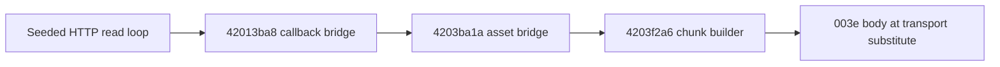

# Gen 2 asset buffers, controller chunks and acknowledgements

## Scope and input pins

This continues [radio asset admission](radio-asset-download.md) and
[MAIN transfer setup](gen2-asset-transfer-export-limits.md) using public
**A1763 C1000 Gen 2** firmware only:

| Component | Version | Bytes | SHA-256 |
| --- | --- | ---: | --- |
| Main | 1.1.4.9 | 198,656 | `21ffb746c1e07ecaa9817fa7017807585a00bedbca3f136c650129bb52a4a0c9` |
| Radio | 0.3.3.0 | 1,482,800 | `e291ec115f013953e825cb51b9e457a8731889547ab55b3058640e599e8cfec8` |

**43 new synthetic instruction cases** pass: 14 HTTP-buffer cases, three
radio ACK-callback cases, two task-registration cases and 24 MAIN chunk/response
cases. Each suite adds four
negative guards. No station command, network request or electrical test runs;
no original C1000 or C2000 equivalence is established.

## Radio buffer and final-chunk contract

Actual registration helper **`4203bcac`** constructs a descriptor and calls the
substituted service `42013a40` with task ID **20**, argument 2 and words
**`2, 4203b98a, 4203ba6a, 4203ba1a`**: locator getter, completion bridge and
progress bridge. Both substituted success/failure returns are preserved. The
real registry/task engine remains excluded; this does not establish execution
of this helper during a device's boot.

The bounded replay enters the HTTP routine at **`4201763a`**, after successful
response/header decisions, with **host-seeded Content-Length state**. Earlier
HTTP setup, task dispatch, socket/TLS parsing and cleanup do not execute.

Actual instructions first request a **2,048-byte allocation** at `42017660`,
falling back to **1,024 bytes** if the substituted allocator rejects it. At
`42017c98`, they clear the allocated buffer **once** through a substituted
memset. The tested branch reads `min(remaining, capacity)` bytes through the
substituted HTTP read at `42017aba`. A positive short return differing from the
requested count exits without forwarding that read; it is not accumulated in
these selected branches. This is a bounded result, not all HTTP error handling.

The actual callback chain is:



The first bridge receives buffer, bytes read, remaining bytes and raw kind 0.
The synthetic task callback selects the asset bridge. Its timer-service calls
are substituted. The actual total-size getter `42016ef6` reads `3fc9031c`.
Chunk construction remains fixed at the MAIN sender's **1,024-byte default**.

| Synthetic content | Buffer | Forwarding result |
| --- | ---: | --- |
| 1 / 1,024 / 1,025 / 2,048 bytes | 2,048 | 1 / 1 / 2 / 2 chunks; unused initial tail is zero |
| 2,049 / 4,097 bytes | 2,048 | 3 / 5 chunks; final padding retains bytes from a prior read |
| Same six lengths | 1,024 fallback | Reads split at 1,024; partial tails after reuse retain prior bytes |
| Deliberate positive short reads | 2,048 | No progress callback or chunk from that read |

All tested chunk copies fit within the HTTP allocation. Independent host
reconstruction checks complete serialized-body hashes, including reused tail
bytes. This narrows the earlier unknown-padding boundary: these default-chunk
branches read initialized/reused buffer bytes, not beyond the allocation.
Other chunk sizes, chunked responses, transport contracts and physical behavior
remain unproved. No hardware memory vulnerability or security consequence is
claimed from this replay.

The actual five-instruction callback **`4203c8fa`** stores ACK flag **1** when
its second argument is zero, and flag **2** for tested nonzero arguments 1 and
`ffffffff`. Buffer cases deliver synthetic zero callback arguments during a
substituted delay. The actual callback sets the flag; the radio framing/parser
that supplies its arguments remains outside this proof.

## MAIN consumer and forwarding

A bounded initialization **prefix**, `08013f90..08013fc2`, installs the 32-byte
callback array through `08029254`; it stops before subsequent registrations or
timers. It establishes **`200054b0 → 080192c1`**. The actual function-10 table
maps **003e → `0800b634`**, which forwards to that callback. This is not firmware
boot or proof that a running device has the same initialized state.

The host supplies a pre-parsed table with the A3 low length byte in its entry
and its high byte at the pointed-to address. Ingress/session parsing is excluded.
Actual lookup `08022576` and consumer `080192c0` then:

1. Ignore an inactive transfer or an already pending chunk.
2. Load A1 offset and A2 total when present. Missing fields retain prior values;
   the fixtures' prior values are zero.
3. Reject total above **`28000` hexadecimal / 163,840 bytes**, or offset at/above
   total, with immediate status 1 and a substituted failure callback, then reset.
4. Read A3's recorded length, clear a 1,034-byte staging region and **copy exactly
   1,024 bytes**, even for tested recorded lengths 1 or 2,048. Initialized fixture
   padding supplies those bytes; this does not test truncated input safety.
5. Queue point **0013**, timeout **1,000**, callback `0801c1b9`, serializer
   `080264d1`, with block index `(offset >> 10) & ffff`; set chunk-pending.

The actual serializer and bitwise CRC emit a **1,040-byte MAIN frame**:
header words **`0010, 0005, 0404, 0013`**, two-byte block index, 1,024 staged
bytes and CRC-16. Every complete frame passes an independent CRC check.
The fixed copy size is further evidence against treating arbitrary radio chunk
sizes as a supported end-to-end API. No live asset API is added.

## MAIN reply and completion boundary

| Synthetic reply to point 0013 | Executed result |
| --- | --- |
| Success argument and `13 00 aa ee` at offsets 10–13 decimal | Clears pending and retry byte; actual ACK builder prepares `083e`, body `A1 01 00` |
| Offset plus recorded A3 length reaches total | Also queues point **0014**, timeout **2,000**, callback `08017bd1`, serializer `080264a5`; emits a fixed 16-byte MAIN frame |
| Missing reply, starting retry 0 | Increments retry byte and queues the identical chunk again |
| Fourth missing reply, starting retry 3 | Substituted failure callback reason 4, transfer reset, ACK body `A1 01 01` |
| Starting retry 255 | Wraps to zero and retries; a synthetic arithmetic edge |
| Wrong point/status/marker with success argument | Leaves pending set without ACK or requeue in this callback |

The final-chunk decision uses **recorded length and total**, while the forwarded
payload still contains 1,024 bytes. A one-byte total with recorded length 1,024
therefore queues the final request after its valid chunk reply. It does not
trim the staged payload locally. Final receiver application, final callback
`08017bd0`, resource format/checksum and flash/file commit remain excluded.
Controller ACK bodies and radio ACK arguments are not passed through a real
transport/parser in these suites.

The later [completion and matching proof](gen2-asset-completion-and-matching.md)
executes the final callback and following point-0016 poll, and separately
executes MAIN's pending radio-request registration, matching and expiry.
Receiver application and the radio's ACK parser remain excluded.

All MAIN cases preserve **415 saved-setting bytes and eight output flags**,
with zero saved-setting reads. Application callbacks and queues are substituted;
this does not establish their live effects or a complete settings exporter.

## Reproduction and remaining work

```sh
SOLIX_ANALYSIS_OUTPUT=/private/output/asset-buffer \
python3 tools/firmware_analysis/emulate_radio_asset_buffer.py \
  --output-dir /private/output/asset-buffer
SOLIX_ANALYSIS_OUTPUT=/private/output/asset-consumer \
python3 tools/firmware_analysis/emulate_gen2_asset_chunk_consumer.py \
  --output-dir /private/output/asset-consumer
```

Compare both complete result/manifest pairs against
`tools/firmware_analysis/expected_results/`. Python **3.14.4**, Unicorn **2.1.4**.
The radio entry bound is 10,000 instructions. MAIN is capped at 100,000 because
its actual 1,038-byte bitwise CRC takes about 68,000 instructions; the largest
observed entry uses **68,642**. ROM/MMIO are read-only and writes are restricted
to synthetic RAM, with saved settings/output writes rejected. Negative guards
cover excluded setup/startup/final callbacks, fixture limits and protected copies.

Remaining concrete boundaries after that continuation: the task/header path
activating the registered radio callbacks, receiver asset application and the
083d/083e framing/parser. MAIN pending-request matching now has a separate
bounded proof; the real enqueue/worker loop remains excluded. Chunked HTTP mode and
other admitted radio chunk sizes need separate analysis. Complete saved-file
readback still requires an independent producer; this download/forwarding route
does not justify restoration or a station filename probe.
