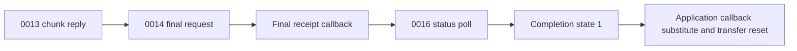

# Gen 2 asset completion and pending-request matching

## Evidence and scope

This continues the [chunk and buffer proof](gen2-asset-chunk-buffer-contract.md)
with **55 synthetic instruction cases and ten negative guards**. The input is
public **A1763 C1000 Gen 2 main 1.1.4.9**, 198,656 bytes, SHA-256
`21ffb746c1e07ecaa9817fa7017807585a00bedbca3f136c650129bb52a4a0c9`.
No original C1000 or C2000 equivalence is established.

Actual selected ARM callbacks, descriptor builders, fixed serializers, timer
wrapper, pending-table registration, dispatch, matching and expiry execute.
Contexts, replies and registration arguments are synthetic host inputs.
Queues, timer services, logging, libc, UART delivery and application callbacks
are substitutes. No station, radio ingress, authentication, socket, firmware
boot, receiver application or flash/file backend runs. Neither suite establishes
an electrical behavior or a complete saved-settings exporter.

## Receipt is followed by a completion poll



The actual final callback **`08017bd0`** accepts a nonzero success argument and
reply bytes **`14 00 aa ee`** at decimal offsets 10–13. It clears the retry byte
at **`20000214+21`**, then queues **point 0016**, timeout argument **10**, null
payload, serializer **`080265dd`**, callback **`08017b4d`**, lane 2. The actual
serializer emits a fixed, CRC-valid 16-byte MAIN frame with header words
**`0010, 0005, 0004, 0016`**. Its complete SHA-256 is
`02ed7561bd18ec59f79c70ffb07520e42a29779818bda448d1bc9d8fc4cd1416`.
Transfer-active remains set and the application success callback is not called.

Missing replies and malformed point/status/marker bytes increment the final
retry byte. Values 1–3 queue another point 0014; the fourth failure clears that
byte, invokes the substituted application callback **`(0, 5)`**, then resets
transfer state. Starting at 255 wraps to zero and retries in the synthetic
arithmetic case. With no application callback, the fourth failure still resets.

The subsequent actual callback **`08017b4c`** requires a nonzero success
argument and bytes **`16 00 01`** at decimal offsets 10–12. It calls the
substituted application callback **`(1, 0)`** and resets. Byte 13 is not checked
in this callback; a changed synthetic value still follows that success branch.
This is a controller interpretation of a supplied response, not proof that the
receiver committed, validated or displayed an asset.

Missing/malformed replies or tested state values 0, 2 and 255 queue another
0016 poll and call **`0802c2f8(2000)`**. Actual wrapper instructions store the
raw period 2000 at `20000214+26`, multiply it by ten and call substituted timer
services with period argument **20,000**, callback **`08017add`** when creation
is needed. A matching existing period restarts the timer without changing it;
a different period stops/changes/restarts it. Timer units, elapsed time and
callback scheduling are not established by this replay. The timer callback
itself remains excluded here; its earlier bounded replay is recorded in
[transfer replies](gen2-asset-transfer-export-limits.md).

The host-delivered chunk → final receipt → completion sequence checks all three
serialized requests and the success/reset ordering. It does not execute the
queue worker or a receiver. Selected queue-rejection fixtures return zero from
the queue substitute; the callbacks still follow their observed control flow.

## Pending radio requests

The actual table at **`20004fe8`** contains **15 twelve-byte slots**:

| Offset | Field established by executed instructions |
| ---: | --- |
| 0 | Callback pointer, u32 |
| 4 | Countdown, u32; duration units unresolved |
| 8 | Request command, u16 |
| 10 | Function, u8 |
| 11 | Active flag, any tested nonzero value qualifies |

Actual function-10 dispatcher **`08022614`** routes opcodes with bit `0800` to
**`08015a58`**, passing function **0010** and the supplied parsed context. The
matcher searches in slot order for active entries with matching function and
**`stored_command | 0800 == incoming_opcode`**. Thus 003d matches 083d and
003e matches 083e. It invokes a nonnull callback **`(1, context)`**, then clears
all twelve slot bytes. A null callback still causes clearing. Duplicates consume
one slot per reply; unrelated slots and the synthetic slot-15 canary remain
unchanged. The callback runs while its slot is still active.

A changed byte zero in the synthetic context does not change matching. These
selected instructions compare command/function, without establishing session,
sequence or authentication checks in the excluded ingress path. This is not an
account-free transport proof.

### Registration behavior worth retaining

Actual registration **`080291e4`** receives command, function, countdown and
callback. Its first pass loads the stored command once, then compares that same
value with **both the incoming command and incoming function** at `080291fe`
and `08029202`. It does not load the stored function in that update branch.

Consequently, re-registering synthetic **003d / function 0010** allocates a
second free slot. A synthetic command/function **0010 / 0010** updates the
existing callback/countdown, even when its stored function is 0011; that stored
function remains unchanged. These are replayed properties of this exact image,
not a whole-program diagnosis or a claim about another firmware version.
With all fifteen slots active and no qualifying update, no slot changes.
The real enqueue/worker call feeding registration remains outside this suite.

### Expiry and actual asset callback

One actual expiry pass **`080308e4`** decrements each active nonzero countdown.
An initial value 0 or 1 expires on that pass: a nonnull callback receives
**`(0, 0)`**, then the slot is cleared. Initial 2 becomes 1; `ffffffff` becomes
`fffffffe`. Inactive slots are skipped. No real service-loop frequency is proved.

Four reply cases deliver through the actual matcher into actual asset callback
**`0803058c`** using a seeded context/payload pointer: status 0 queues a null
payload/serializer 003d retry, 2 leaves the transfer active without a new queue
entry, and 1/255 call the substituted failure callback `(0, 1)` and reset.
An expiry case also executes that callback and queues the retry. New pending
registration for those substituted queue entries is not executed. The radio's
083e parser and the argument supplied to radio ACK callback `4203c8fa` remain
unresolved.

## Reproduction and remaining boundaries

```sh
SOLIX_ANALYSIS_OUTPUT=/private/output/completion \
python3 tools/firmware_analysis/emulate_gen2_asset_completion.py \
  --output-dir /private/output/completion
SOLIX_ANALYSIS_OUTPUT=/private/output/matching \
python3 tools/firmware_analysis/emulate_gen2_asset_request_matching.py \
  --output-dir /private/output/matching
```

Compare each complete result/manifest pair with
`tools/firmware_analysis/expected_results/`. Both pairs independently reproduce,
including source hashes. Environment: Python **3.14.4**, Unicorn **2.1.4**.
Completion has 25 cases, a 100,000-instruction entry bound and maximum **68,642**
for the earlier chunk CRC. Matching has 30 cases, bound 3,000 and maximum **307**.
Both preserve 415 saved-setting bytes and eight output flags, with zero saved
reads. Guards reject excluded application/startup/worker entries and protected
writes. ROM/MMIO remain read-only; only synthetic RAM writes are admitted.

Next precise boundaries: receiver handling of points 0013/0014/0016 and its
resource format/checksum/commit; actual radio 083e framing and ACK argument
mapping; full task/header activation; and an independent saved-state producer.
None of this adds a live asset API, restoration command or charging-pause
encoder. Physical validation still needs an established protocol route and
independent observations; no device needs to be disturbed for these proofs.
