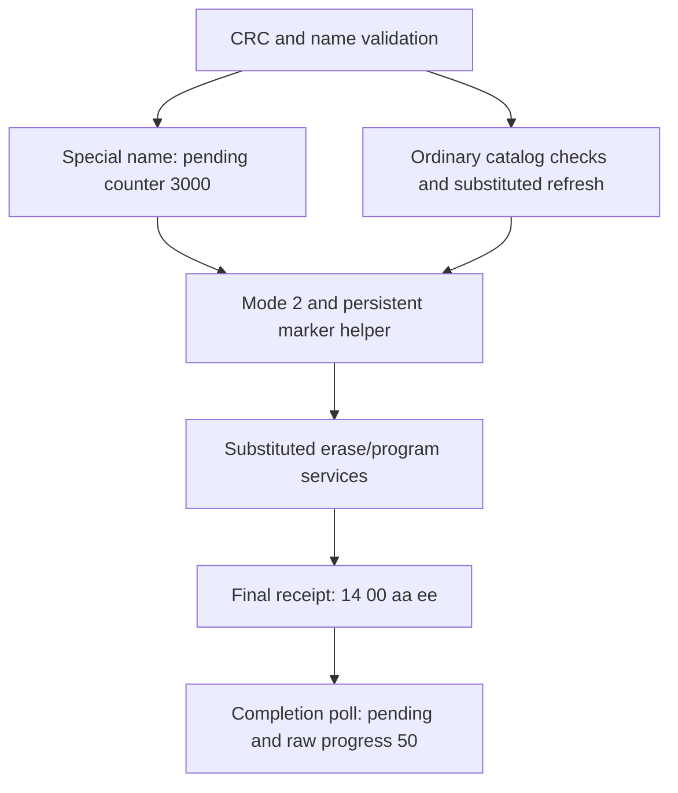

# LCD resource names, mapping and pending-update marker

## Evidence and scope

This continues [LCD staging and validation](lcd-asset-transfer-validation.md)
with **43 synthetic instruction cases and eight rejection guards**. Input:
public **A1763 C1000 Gen 2 LCD container 0.1.9.6**, supplied with main 1.1.4.9,
925,696 bytes, SHA-256
`c314816f396d6b6958a6a398476eafa182f7c368802569803b60bd6a4e6dc97d`.
The 214,016-byte application mapped at `08006000` has SHA-256
`f5683c2f7c9a5bdab638123a7a0a547d3d549e513e18fc10918ed979b83459c6`.

Actual selected initialized-data decompression, ingress/CRC, descriptor iteration,
bytewise string comparison, name/size policy, mapping checks, cleanup accounting,
pending-marker serialization and reply instructions execute. Heap, SPI/storage,
memory operations, logs, UI/renderer refresh and flash erase/program services
remain explicit substitutes. No boot, real driver/MMIO, station, flash/file
write or resource application executes. No other-model equivalence, live
update API, settings export or new charging command is established.

## Recovering the initialized resource catalog

The pinned scatter record at **`0803a044`** declares source `0803a068`, RAM
destination `20000000`, output length **1,520**, helper **`08006cb0`**.
Only that helper executes, with reads/writes bounded to the selected compressed
stream, initialized RAM and synthetic stack. Reset, the subsequent zero-fill
record and firmware startup do not run.

An independent host decoder exactly reproduces the output: **421 compressed
bytes consumed**, output SHA-256
`cfbbfae6df83687b91c87016bb40622b3e1a41da1698d7f13b888d1f1e909b5f`.
Actual replay takes **8,281 instructions** under a 30,000-instruction bound.
The recovered **14 × 12-byte** catalog at `2000053c` supplies these names and
capacity words, subsequently used by the executed mapping checks:

| Index | Name | Capacity word, bytes |
| ---: | --- | ---: |
| 0 | `startup` | 614,400 |
| 1 | `ss_hour` | 155,648 |
| 2 | `ss_min` | 155,648 |
| 3 | `ss_bg` | 155,648 |
| 4 | `was_reset` | 462,848 |
| 5 | `fast_charge` | 1,847,296 |
| 6 | `cumu_usage` | 528,384 |
| 7 | `first_pv` | 1,245,184 |
| 8 | `cumu_pv` | 528,384 |
| 9 | `normal2tou` | 524,288 |
| 10 | `tou2normal` | 524,288 |
| 11 | `dev_idle` | 495,616 |
| 12 | `silent_charge` | 1,282,048 |
| 13 | `super_output` | 1,363,968 |

The middle word is 4,096 for `startup` and `ffffffff` for the others; its full
runtime meaning is not established. Capacities are comparator values, not
verified physical partition sizes. All fourteen name lookups execute using the
recovered catalog and actual bytewise comparison `08006226` with prevalidated
bounded pointers. Catalog bytes remain unchanged.

These are display-resource identifiers. Names involving charging, cumulative
usage, solar input or TOU do not themselves identify station controls or counters.
The three clock capacities equal the earlier fixed count **152 × 1,024**;
that agreement does not establish a complete clock-asset format or update.

## Name policy after each CRC

Actual `0802d9f2..0802da56` compares names exactly, with case-sensitive byte
comparison. It treats **`pps_lcd`** and **`pps_lcd_res`** specially:

| Name | Selected declared-length limit | Above-limit response |
| --- | ---: | --- |
| `pps_lcd` | `3a000` hex / 237,568 bytes | `14 00 03 00` |
| `pps_lcd_res` | `c0000` hex / 786,432 bytes | `14 00 03 00` |

Each exact-limit and limit-plus-one case uses an explicitly **host-modified
post-CRC header**. Earlier instructions validate a four-byte synthetic payload,
then the host changes the declared length and resumes at `0802d9c6`.
These fixtures prove downstream size decisions, not CRC validation, transfer
or storage of a large payload. Results label that distinction explicitly.

Other tested names, including `pps_lcd_extra` and `PPS_LCD`, reach the ordinary
mapping route. The first pass iterates two-entry fixtures, preserves the special
selection when a special entry is present, and rejects a later altered CRC with
`14 00 05 00`. Zero length or length above staged bytes rejects before CRC with
`14 00 03 00`. These error paths set flag/mode to **1/0** and release the
synthetic header once. Full maximum-length descriptor-table behavior is unproved.

## Ordinary mapping pass

The ordinary route at **`0802da98`** allocates and reads a second 1,024-byte
header after releasing the first. Actual `0802db14` compares each descriptor
name against the fourteen catalog entries. For a match it reads the payload's
leading little-endian 32-bit word through a substituted four-byte SPI read.

- Leading values **1/300** pass the selected `1..300` check; **0/301** set an
  error flag and produce `14 00 08 00` after cleanup.
- Actual `0802db98..0802dba4` requires **declared payload length + 4 ≤ catalog
  capacity**. Post-CRC `ss_hour` size fixtures pass at 155,644 and reject at
  155,645; complete large-payload validation remains excluded.
- Unknown names are skipped in this pass. With the supplied state and refresh
  substitute, an unknown-only or empty descriptor list can still reach marker
  handling. This does not prove that any resource was applied.

The renderer/resource refresh at **`0802a374`** is substituted. Leading-word
meaning and the complete payload format need tracing into that runtime consumer;
passing this header check does not prove valid images, animations or frame data.

Heap allocation/free are substitutes with explicit synthetic allocation headers
and accounting. Actual caller bookkeeping releases one header for special/error
paths, or two for ordinary paths; the fixture's used count ends at zero and no
header remains live. This establishes selected cleanup branches, not real heap
integrity, allocation failure recovery or concurrent operation.

## Pending state and marker destination



The special route sets raw pending counter **3,000** at `200002b8`, clears
`200002c4` and calls substituted UI signal `(1, 1)`. Units and the subsequent
worker are unproved. The ordinary route stores its context pointer at
`20000400` and calls substituted UI signal `(11, 1)`. Both retain mode **2**.

Both reach actual marker helper **`0802e3e4`** with argument **`a5a5a5a5`**.
The helper reads **20 bytes at `08005000`**, preserves the supplied following
four words, replaces the first word with that argument, and calls erase service
**`08013f84`** then program service **`08014140`**, each with address `08005000`
and length 20. The erased physical extent is not established by the caller's
length. These services are host substitutes; their instruction bodies never run.
The parameter page is absent from the supplied application and is seeded with
synthetic words for this proof. Its emulated contents remain unchanged.

Cases either stop before the helper or execute it with those substitutes.
After substituted service returns, actual reply construction emits
**`14 00 aa ee`** and a following actual point-0016 poll emits **`16 00 00 32`**:
completion false, raw progress 50. A receipt therefore precedes the unresolved
worker/application stage. Marker persistence, actual installation, reboot,
recovery and output behavior are not verified.

## Reproduction and remaining boundaries

```sh
SOLIX_ANALYSIS_OUTPUT=/private/output/lcd-selection \
python3 tools/firmware_analysis/emulate_lcd_resource_selection.py \
  --output-dir /private/output/lcd-selection
```

Compare both complete `lcd-resource-selection-{results,manifest}.json` files
with `expected_results/`. They independently reproduce, including source hashes.
Python **3.14.4**, Unicorn **2.1.4**. Transfer entries are bounded at **100,000**
instructions; observed maximum **9,723**, including the earlier chunk ingress.
Eight guards reject boot/real flash/refresh instructions, catalog/MMIO writes,
unbounded name pointers, missing size checkpoints and copy-source overreads.
Code and parameter page are read-only during execution; PRIMASK restoration,
catalog preservation and synthetic accounting are asserted. Raw initialized
data/disassembly stay ignored/private; public outputs contain metadata and hashes.

Next: trace the readers of `200002b8`/`20000400`, UI dispatch and actual refresh
`0802a374`, then the marker consumer and precise resource/code destinations.
The bootloader region below `08006000` is absent from this input; a missing
consumer may require a separately obtained public image. Establish commit and
recovery before exposing a transfer API. True charging pause, account-free
ingress, full saved-state readback and physical calibration remain independent
needs. **Zero station commands were sent; the live deployment is unchanged.**
