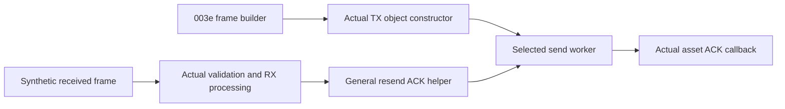

# Radio asset acknowledgements and LCD completion status

## Evidence and input pins

This continues [MAIN completion and matching](gen2-asset-completion-and-matching.md)
with **26 synthetic instruction cases and ten negative guards**. It uses public
A1763 C1000 Gen 2 firmware supplied with main **1.1.4.9**:

| Component | Version | Bytes | SHA-256 |
| --- | --- | ---: | --- |
| Radio | 0.3.3.0 | 1,482,800 | `e291ec115f013953e825cb51b9e457a8731889547ab55b3058640e599e8cfec8` |
| LCD container | 0.1.9.6 | 925,696 | `c314816f396d6b6958a6a398476eafa182f7c368802569803b60bd6a4e6dc97d` |
| LCD application within container | Container version above | 214,016 | `f5683c2f7c9a5bdab638123a7a0a547d3d549e513e18fc10918ed979b83459c6` |

Actual selected instructions execute with synthetic memory and frames. OS,
queues, allocation, mutexes, time/delay, libc, logs, physical transport and
session/cryptographic services are substitutes. No station, network, controller,
firmware boot or resource backend runs. No original C1000/C2000 equivalence or
account-free setup is established. This changes research tools and metadata;
no live transfer API is added.

## The radio asset ACK indicates receipt

The radio suite executes this chain:



Actual `42053f70 → 420543bc` creates a queued object with the supplied port-2
descriptor, raw timeout 1,000, command **003e** and callback **`4203c8fa`**.
The object contains the actual serialized/XOR-checked frame. The fixture has a
small initialized A3 payload; this does not establish default-size chunk
fragmentation or every MTU contract. The OS queue and physical send are
substituted. A host pause/resume delivers one reply during a substituted delay;
the real scheduler and UART never execute.

Actual receive processing `4204d30e` tests the reply bit before payload
classification and calls **`42054506`**. That helper stores the command with
bit **0800** removed at **`3fc9070c`**, and compares it with the waiting command
at **`3fc82a50`**. The selected worker **`42054526`** observes that match,
clears both words to `ffff`, and calls the actual asset callback with
**`(003e, 0)`**. Its actual instructions store ACK flag **1** at **`3fc90604`**.

| Received synthetic frame | Worker/callback result |
| --- | --- |
| Function 0010 / 083e, body `A1 01 00` | One send, callback argument 0, ACK flag 1 |
| Same frame, body `A1 01 01` | Same receipt result; failure TLV is not interpreted by this callback |
| Raw body 00 / 01, empty body or arbitrary initialized body | Same receipt result |
| 083e with function 0017 | Same receipt result in this selected general helper; no function comparison |
| 083f, nonreply 003e or altered outer checksum | Three sends, callback argument 1, ACK flag 2 |

Both port-2 and port-0 plaintext fixtures exercise the raw receive entry. The
port-0 case does not prove a real BLE session: session handling is synthetic.
The helper's command-only comparison does not establish which checks a live
session/transport performs elsewhere.

On timeout, the selected worker sends the same frame three times and calls
`4203c8fa(003e, 1)`, storing ACK flag 2. Its waiting word remains **003e** in
these timeout cases, while successful receipt clears it. Timeout arguments
1 / 5 / 1,000 / 2,000 produce 0 / 3 / 600 / 1,200 substituted delay calls with
argument 5. The division/wrap and retry branches execute; wall-clock duration
and physical retry behavior are not verified.

This resolves the earlier unknown origin of the radio callback's second
argument for these routes. It distinguishes receipt from controller rejection
or receiver commit. Future transfer support still needs final completion
verification, receiver validation and established recovery behavior.

## LCD application extraction and matching points

The LCD container header declares payload start **400 hexadecimal / 1,024**.
Its stored byte sum **`034b569e`** equals the bytes after that offset; the full
container sum remains the existing manifest's **`034edbc6`**. The first
application has length **`34400` hexadecimal / 214,016**, and its independently
computed CRC-16/MODBUS equals the header value **`a038`**.

The application begins with stack pointer **`20016918`** and reset vector
**`08006145`**. Mapping it at **`08006000`** places the pinned reset-stub
instructions at the vector's target. Those instructions are checked statically;
reset/boot is not executed. The remaining container/resource format is not
fully decoded.

Actual receiver **`0802d038`** checks the supplied MAIN frame's CRC, uppercase
`MAIN` header and selector 5. Its executed table branch at **`0802d13e`** maps:

| MAIN point | LCD target |
| --- | --- |
| 0010 | `0802d150` |
| 0012 | `0802d236` |
| 0013 | `0802d336` |
| 0014 | `0802d352` |
| 0016 | `0802d36a` |
| 0011 / 0015 | Default response at `0802e182` |

This associates the controller's transfer points with a matching implementation
in the LCD application. Physical wiring, initialization and a complete transfer
are not exercised.

## Executed LCD status responses

The host supplies the receiver context, state word and buffers. Actual ingress,
point selection, status branches and reply builder **`0802e434`** produce
CRC-valid, lowercase **`main`** frames, each 16 bytes:

| Point / seeded state | Response bytes at decimal offsets 10–13 |
| --- | --- |
| 0016, mode byte 0 / flag byte 0 | `16 00 01 64` |
| 0016, mode byte 0 / flag byte 1 | `16 00 01 00` |
| 0016, mode byte 2 | `16 00 00 32` |
| 0016, unknown mode byte 3 | `16 00 00 00` |
| 0014, mode byte 2 | `14 00 01 00`; state word becomes 1 |
| 0013, mode byte 2 | `13 00 01 00` |
| 0013, supplied offset above `400000` | `13 00 06 00` |
| Unhandled 0015 | `15 00 07 00` |

For 0016, byte 12 is the completion indicator consumed by MAIN's callback;
byte 13 supplies the raw progress value in these branches. An idle supplied
mode-zero state reports completion and 100 without a preceding transfer.
These answers alone cannot prove resource commit. The mode-2 0014 case calls
one substituted UI signal `(13, 0)`; it is a state-changing synthetic case,
not a passive query. Its markers differ from MAIN's normal final-ACK predicate.
The meanings and initialization of these mode bytes need further tracing.

Mode byte 1 reaches **`0802d652`**, the floating-point progress calculation;
the replay stops before it. Ordinary chunk storage at **`0802d5fa`** and
non-mode-2 final/resource handling at **`0802d3d8`** are guarded exclusions.
Bad CRC and wrong selector fixtures produce no response. No flash operation,
resource read/write, interrupt-mask change or actual display update executes.

## Reproduction and next boundaries

```sh
python3 tools/firmware_analysis/emulate_radio_asset_ack.py \
  --output-dir /private/output/radio-ack
SOLIX_ANALYSIS_OUTPUT=/private/output/lcd-status \
python3 tools/firmware_analysis/emulate_lcd_asset_status.py \
  --output-dir /private/output/lcd-status
```

Compare both complete result/manifest pairs with `expected_results/`. They
independently reproduce, including source hashes. Environment: Python **3.14.4**,
Unicorn **2.1.4**, cryptography **50.0.2**. Radio: 15 cases, instruction bound
100,000 per entry, observed maximum **16,927**. LCD: 11 cases, bound 10,000,
maximum **407**. Each adds five rejection guards. Radio protected state is
preserved; LCD writes are limited to synthetic stack/output buffers and the
two-byte state word. ROM/code remain read-only; MMIO writes are rejected.

Next: trace the LCD start-state producer at point 0010, then ordinary chunk
and final resource paths toward their precise SPI/storage substitutes; recover
the resource format/checksum before a complete transfer replay. Radio task/header
activation and default-size fragmentation remain separate boundaries. True
charging pause, complete saved-state readback and physical energy calibration
remain open; this resource route does not resolve them.

The [LCD transfer continuation](lcd-asset-transfer-validation.md) executes
descriptor admission, chunk ordering/page construction, whole-byte-sum checking
and first-entry CRC decisions with synthetic SPI/storage. Name handling,
preparation/erase and commit remain excluded.
