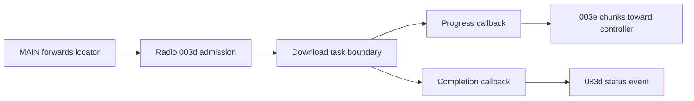

# Gen 2 radio asset download and controller forwarding

## Scope and result

The C1000 Gen 2 / **A1763 radio 0.3.3.0**, retained with main firmware
**1.1.4.9**, accepts an HTTP/HTTPS asset locator through internal command
**003d** and prepares a download task. Its progress callback serializes chunks
for the controller through **003e**, and completion uses **083d** status events.
This supports the download interpretation of the
[MAIN asset-transfer route](gen2-asset-transfer-export-limits.md). It provides
no complete saved-settings export or external BLE/MQTT command.

Input: `firmware/c1000_gen2/1.1.4.9/c1000-radio-validated.bin`, **1,482,800 bytes**,
SHA-256 `e291ec115f013953e825cb51b9e457a8731889547ab55b3058640e599e8cfec8`.
No original C1000 or C2000 equivalence is established.

**34 synthetic cases** replay actual bounded RISC-V instructions: admission
`4203f4ee`, TLV lookup/builders, helper setup `4203bab4`, progress `4203f2a6`,
completion `4203f088`, locator handover `4203ef1a` and status builder `4203e15c`.
Allocation/libc, mutexes, task services, time, cancellation, logging, transport
and ACKs are explicit substitutes. The host enters with synthetic pre-parsed
requests; ingress parsing, session authorization, HTTP worker, DNS/TLS,
filesystem, controller and firmware boot do not execute. **Zero station
commands** are sent. This is instruction replay, not a physical transfer test.

## Admission and task boundary

The command table at `3c147be4` maps 003d to `4203f4ee`.

| Field | Executed validation or use |
| --- | --- |
| A1 | Required; reads a little-endian 32-bit start-offset argument |
| A2 | Required; reads/stores a 16-bit chunk size, then requires `2048 % size == 0` |
| A3 | Must immediately follow A2; 16-bit length, admitted range 8–512 bytes |
| Locator | Case-sensitive `http:` or `https:` prefix check |
| Optional A4 | Following the locator; 16-bit timeout multiplied by 1,000 |

The prefix check admits synthetic `http:abc`; it is not complete URL validation.
Missing A1/A2, `sysPara`, FTP, uppercase HTTPS, lengths 7/513, and chunk sizes
0/300/4096 return status 1. HTTP/HTTPS, lengths 8/512 and sizes 512/1024/2048
reach the substituted task boundary and return status 0. These initialized
fixtures do not establish truncated-packet safety or all ingress constraints.
The chunk global is written **before** rejection; this route is not passive.

The helper copies the locator and a five-word callback configuration, then
calls `42013a2a` with raw task ID **20**, progress/completion targets above and
the start offset. The tested A1 value 3,072 reaches this boundary. A seven-second
A4 stores 7,000; the default is 180,000. Task failure, allocation failure and
mutex failure return 1. The allocator/free substitutes do not establish actual
pointer lifetime. The underlying task wrapper calls `42012a98`; its real worker
and scheduling remain outside this replay.

## Chunk and completion behavior



Progress builds function **0010** / command **003e**, body length `15 + chunk`:
A1 is a four-byte forwarding offset, A2 a four-byte total-size getter result,
and A3 a **16-bit-length** chunk. The descriptor selects port 2, timeout 1,000
and callback `4203c8fa`. Actual TLV builder instructions run, but outer framing
and delivery do not. A substituted ACK byte 1 permits offset advancement.
Neither a real controller ACK nor file application is tested.

Lengths 0/1,024/2,048 generate 0/1/2 frames. For synthetic length **1,025**, the
callback still copies and forwards **2,048 bytes** in two chunks and advances
the offset to 2,048. The fixture deliberately supplies initialized padding.
The real HTTP buffer allocation/padding contract is unknown; this does not
establish an out-of-bounds access or information disclosure on hardware.

The [buffer/consumer continuation](gen2-asset-chunk-buffer-contract.md) narrows
that boundary for a seeded Content-Length branch with the default 1,024-byte
chunk: actual allocation decisions and callbacks use a cleared 2,048-byte
buffer or a 1,024-byte fallback. Reused partial tails retain prior bytes, and
all tested copies remain within that allocation. Other branches remain open.

| Synthetic callback condition | Executed outcome |
| --- | --- |
| Progress elapsed 180,001 or cancel flag | No chunk; invokes cancellation/task-service substitutes |
| Progress kind 3 | Re-enters download setup for the current locator; no chunk |
| Completion argument 0 | Sends one-byte 083d status 2; clears current locator; returns 1 |
| Completion argument 1, before timeout | Re-enters download setup; returns 0 |
| Completion arguments `6000a`/`6000d` | Return 0 without chunk/status or retry; meanings unresolved |
| Completion with cancel flag | Clears transfer state/current locator; returns 1 |
| Completion after timeout | Sends 083d status 3, clears current locator; returns 1 |

Async status descriptors use port 2, timeout 300 and no callback. Fixed synthetic
identity/Wi-Fi regions remain unchanged. This does not describe other tasks,
application callbacks or live settings preservation.

## Reproduction and remaining boundary

```sh
SOLIX_ANALYSIS_OUTPUT=/private/output/radio-assets \
python3 tools/firmware_analysis/emulate_radio_asset_download.py \
  --output-dir /private/output/radio-assets
```

Compare complete `radio-asset-download-{results,manifest}.json` files with
`tools/firmware_analysis/expected_results/`. Python **3.14.4**, Unicorn **2.1.4**;
each entry is capped at **10,000 instructions**. Five negative guards reject
short/changed firmware, instructions/writes outside the allowlists and
unterminated bounded locator text. Independent runs reproduce both artifacts.
Outputs contain synthetic hashes/metadata, not captured credentials or frames.

The follow-up also replays task-20 registration, the bounded HTTP producer,
MAIN 003e consumer, chunk ACK and final-request construction. Full task/header
selection, final application and 083d/083e framing/matching remain open. Main's
null-payload retry descriptor has not been transported end to end.
A distinct read-only producer returning complete
controller settings is still needed before offering backup restoration. Do not
probe stations with filenames or expose this state-changing download route as
a saved-settings query.
