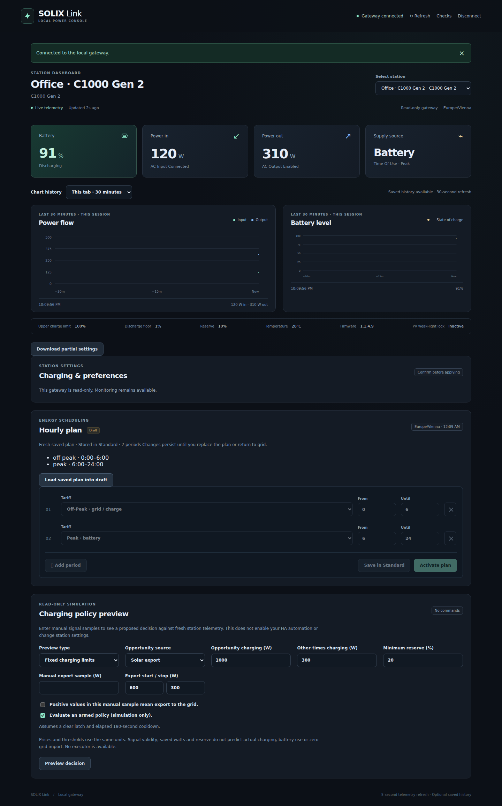

# Partial settings export and saved TOU readback

These features read cached status only. They do not pair, poll a station, write
settings or provide a restoration endpoint. They are source additions on the
server research branch; the live gateway/worker must be updated separately.

## Export preferences

The authenticated `GET /devices/{name}/settings-export` works with controls
disabled. The browser's **Download partial settings** uses the same route.
For an offline snapshot or an existing gateway:

```sh
solix-link settings-export --snapshot-file snapshot.json > preferences.json
solix-link settings-export --gateway-url http://127.0.0.1:8765 \
  --gateway-token-file /private/http-token --name office > preferences.json
```

Exports include model, reported firmware, validated known preference fields,
missing/invalid field names and telemetry freshness. They omit station names,
identity/authentication, raw TLVs and runtime output states. Every export has
`complete: false`, `restore_supported: false` and
`field_freshness_verified: false`: fresh general telemetry does not prove that
every merged cached field was read in that sample. Export files are references
for comparison, not full backups or command scripts.

The original C1000 export excludes unestablished Gen 2 cap/reserve/TOU controls.
Hidden clock and automatic disaster/backup records remain unavailable; see
[status export limits](gen2-full-status-inventory.md).

## Native Gen 2 hourly plans

Native C1000 Gen 2 and C2000 Gen 2 snapshots optionally include
`tou_plan_readback`, containing only:

```json
{
  "schema_version": 1,
  "enabled": false,
  "periods": [{"tariff": "off_peak", "start_hour": 0, "end_hour": 6}],
  "reported_at": 1700000000,
  "source": "status_d9"
}
```

The decoder requires the complete established D9 block, Standard/TOU mode,
at most six valid nonoverlapping whole-hour slots and its exact tail length.
Enabled-but-empty, unknown-mode or malformed blocks invalidate readback.
Absent D9 preserves its old timestamp; unrelated telemetry cannot refresh it.
A new MQTT subscription clears it. The tail's hidden records are **not** an
exported backup. Existing command results retain their separate `tou_plan` list.

Freshness requires a connected/available native station and both telemetry and
plan ages within -5..30 seconds, excluding the upper bound. Export includes
`tou_plan_fresh`; stale cached content remains explicitly historical. HA's
Usage mode sensor exposes `saved_tou_plan` and `saved_tou_plan_fresh` attributes.

Browser and terminal F3 show independently fresh readback and offer **Load
saved plan into draft**. Loading only changes the local editor; polling preserves
edits. Saving/activation still requires the existing explicit control flow.
Hours use the configured station timezone. Readback is not proof of current
electrical supply, complete settings, automatic plan ownership or safe rollback.

## Evidence



Synthetic MQTT sessions cover unrelated/retained/foreign/malformed messages,
connection replacement, timestamp expiry and detached copies. API/CLI/HA/terminal
and browser tests cover sanitized export and read-only access. One cached live
GET recognized nine original C1000 preferences on reported **1.7.1** and fifteen
C1000 Gen 2 preferences on **1.1.4.9**. The deployed worker lacked the new plan
field; no new station command or physical behavior test occurred.
