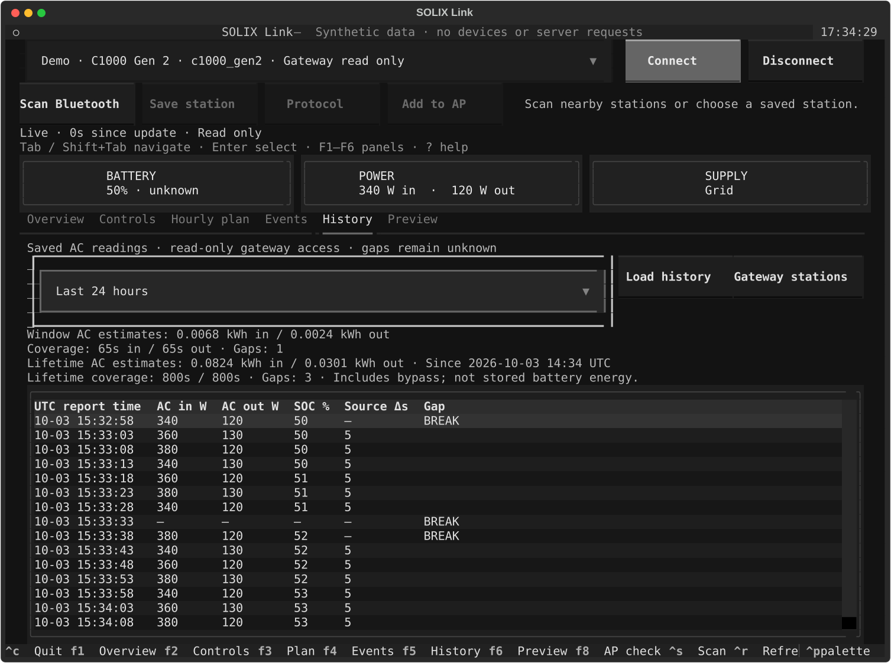
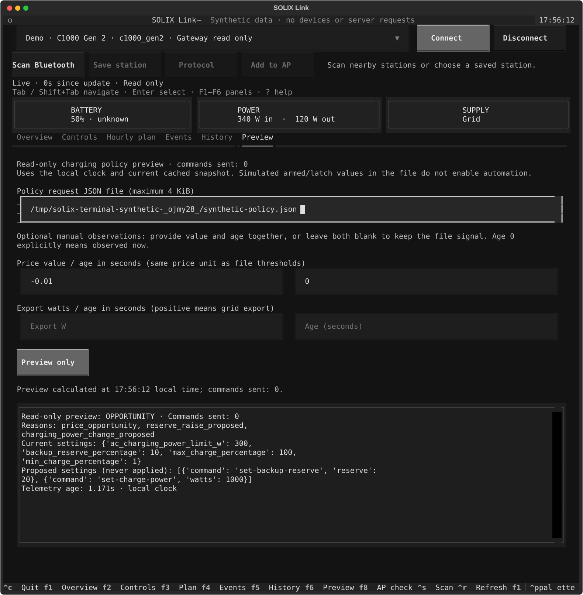
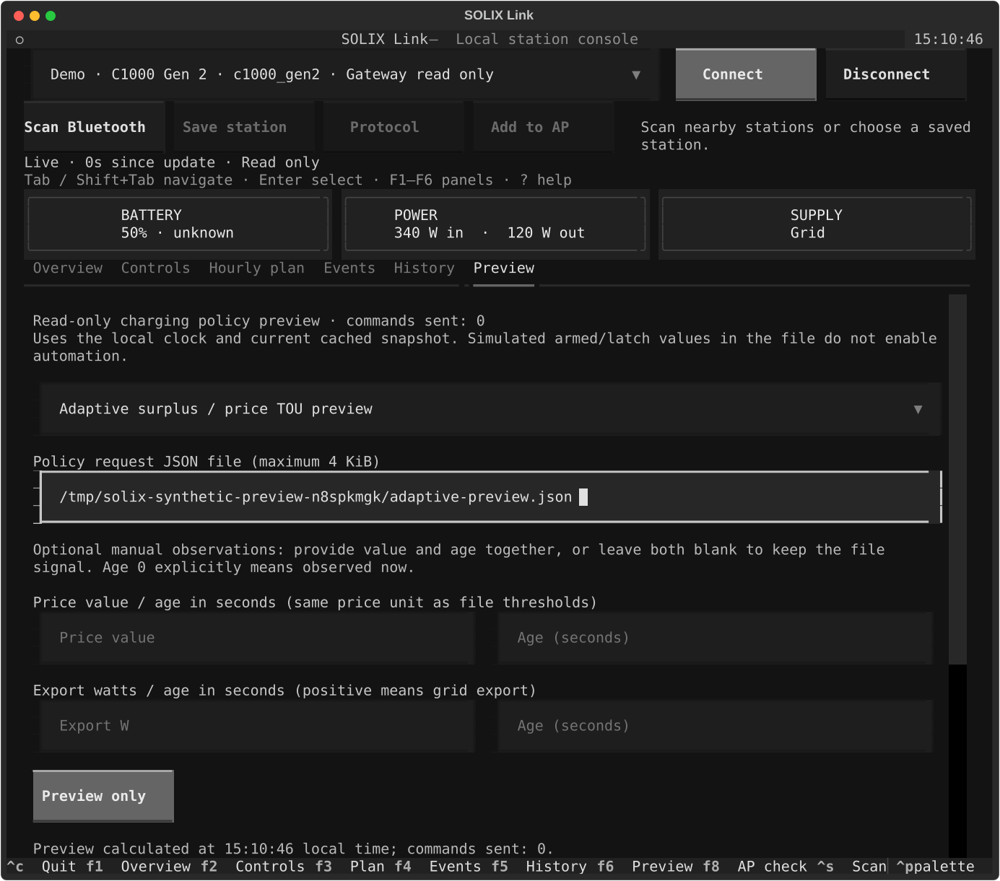

# Terminal saved history and policy preview

The full-screen terminal retains local BLE/AP monitoring and explicit controls.
An optional **read-only HTTP gateway source** adds cached remote monitoring,
saved history and charging-policy previews. It never starts a station transport,
opens the gateway's SQLite database or sends HTTP setting commands, even when
the gateway advertises controls.

## Connect explicitly

```sh
solix-link tui --gateway-url http://127.0.0.1:8765 \
  --gateway-token-file /private/http-token
```

The token file must be an owner-only regular file, such as mode `0600`, owned
by the terminal user. Tokens are held in memory and never displayed or saved.
HTTP/HTTPS URLs cannot contain credentials, queries or fragments. Redirects
and environment proxies are disabled; responses and request times are bounded.
Use the gateway's already configured URL and exact public station names.

Gateway stations have a **Gateway read only** label. Connect reads cached
status; Refresh does not request new Bluetooth/MQTT telemetry. Controls and
hourly-plan writes remain unavailable for these targets. Local BLE/native
targets remain separate and retain their existing manual workflows.

## F5: Saved history

Select a one-hour, six-hour, 24-hour or seven-day window, then **Load history**.
The table shows UTC telemetry report times, AC input/output watts, SOC, source
intervals and explicit `BREAK` rows. Unknown values are `—`, not zero. History
is fetched only when requested; live status polling does not repeatedly query
the history database.

Window/lifetime AC energy values are **estimates** with separate coverage and
gap counts. Lifetime values include expired rows and show the collection epoch.
AC totals include bypass power and do not measure energy stored in the battery.
See [persistent history](persistent-history.md). A failed request clears the
table; replies arriving after selection, window or disconnect changes are ignored.



## F6: Read-only policy preview

Choose a JSON request file following the complete
[charging-policy contract](charging-policy-preview.md). The 4 KiB file contains
policy settings and selected price/export observations. Its armed, latch and
cooldown inputs are **simulated assumptions**; they do not change HA helpers or
enable an automation.

Select **Adaptive surplus / price TOU preview** for the separate
[adaptive request contract](adaptive-policy-preview.md). The file also supplies
previous-preview state. F6 displays candidate plans without applying them;
manual value/age overrides still require the original file to be valid. Switching
preview type invalidates the result. The fixed preview remains the default.

Optional manual observations require both a value and age in seconds. Leaving
both blank preserves the file signal. Age `0` explicitly means observed now.
Price uses the file's own units, within -1000–1000; export accepts -20000–20000 W,
with positive meaning grid export. Ages are whole seconds within 0–86400.
Malformed, incomplete, nonfinite or unselected signal overrides are rejected.

**Preview only** runs the pure policy function against the cached snapshot.
It shows reasons and proposals with **commands sent: 0**, with no Apply action.
Editing inputs invalidates the result. Changed telemetry marks completed results
historical; late results from a changed snapshot or selection are discarded.
Draft inputs survive polling.

The calculation uses the **terminal's local clock**, while HTTP previews use
the gateway's clock. Clock skew can produce stale/future blocked reasons; no
fresh timestamp is invented. Only native MQTT Gen 2 profiles are eligible.





## Line fallback and scripts

```sh
solix-link interactive --gateway-url http://127.0.0.1:8765 \
  --gateway-token-file /private/http-token
solix-link gateway-history --gateway-url http://127.0.0.1:8765 \
  --gateway-token-file /private/http-token --name office --limit 200
solix-link charging-preview --snapshot-file snapshot.json --request-file policy.json
```

Gateway line mode offers cached status, saved history and the same manual
preview without a Bluetooth scan. `gateway-history` returns bounded JSON;
optional `--since`/`--until` are finite UNIX seconds, with at most 2000 points
and a 31-day explicit interval. Existing offline/scripted CLI options remain
available without Textual. All screenshots and tests use synthetic data.
