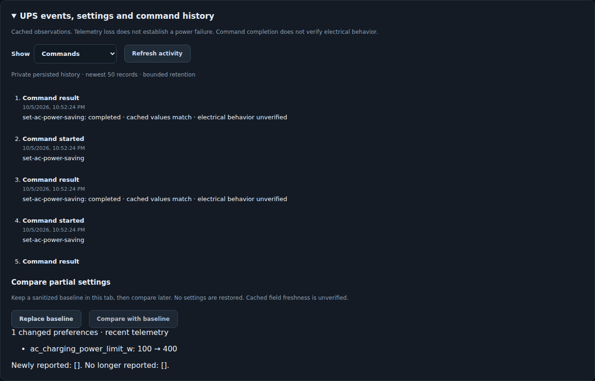

# UPS activity, settings comparison and HTTP permissions

These features are implemented in the local gateway. They observe cached
telemetry; they do not add BLE/MQTT queries, station commands or shutdown actions.
Updating source does not change the deployed gateway or HA integration.

## UPS observations and HA alerts

The gateway records `mains_lost`, `mains_restored`, `telemetry_lost`,
`telemetry_restored`, `battery_low`, `battery_recovered` and `settings_changed`.
Mains transitions require an explicit integer 0/1 input flag, distinct source
reports and five seconds of observation. First contact establishes a baseline;
it does not invent an outage. Gaps and regressing reports cannot establish mains
loss. A transition observed after a gap has `interval_unknown: true`: its exact
start time is unknown. Clock rollback or a model/transport change resets the
observation baseline. Events missed during gateway downtime cannot be recovered.

Native telemetry expires after 30 seconds; other transports after 90. Low
reserve means SOC **below** the greater of 20% and a valid reported backup
reserve. Recovery requires five percentage points above the threshold, capped
at 100%. Invalid/missing values are unknown; reserve is a cached preference,
not an independently refreshed field or an energy measurement.

`GET/HEAD /devices/{name}/activity?limit=100&after=0` returns a bounded history.
`limit` is 1–200. Without `after`, it returns the latest records in ascending ID
order; a positive cursor returns the next records. IDs restart with an
in-memory gateway session. Default storage is memory only, capped at 10,000
records/seven days. Opt in to private SQLite persistence with:

```sh
solix-link ap-service-serve --directory /private/ap-service \
  --activity-file /private/activity/events.sqlite --activity-retention-days 7
```

Use a directory owned by the runtime user with mode 0700; the database uses
0600. Persistence refuses symlinks, unrelated databases and another writer.
Do not use the telemetry-history database for activity. Queries enforce age
and count limits; retention removes rows, not a forensic secure-erasure promise.

Updated HA exposes **Telemetry available** and **Battery reserve low**. The
communication entity remains available/Off when polling fails; Mains present
and reserve become unavailable with stale data. An older gateway can support
the communication entity, but reserve requires the new `ups_state` contract.
The optional [UPS alerts blueprint](../blueprints/automation/solix_link/ups_alerts.yaml)
starts disabled, requires an arming helper and checks device ownership/entity
roles. Its default action is a local persistent notification. Users can choose
notification actions using `alert_event`/`alert_message`. No notifications are
sent by installing these source files. Original C1000 lacks established mains
readback and therefore cannot supply the mains-alert input.

## Partial comparison and command results

The browser Activity panel shows observations and HTTP command history. Capture
a sanitized settings baseline in tab memory, then **Compare with baseline**.
Changing station or disconnecting removes that panel's baseline. This sends
only cached read requests and a comparison request, never a settings write.



`POST /devices/{name}/settings-compare` accepts `{"baseline": <partial export>}`
(maximum 32 KiB, no duplicate JSON keys). It returns common-field changes plus
newly/no-longer reported fields; different/unknown models are incompatible.
Only independently fresh, validated TOU plans are compared; report timestamps
are excluded from plan equality. Identities, output states and unknown fields
are omitted. Offline use:

```sh
solix-link settings-diff --before before.json --after after.json
```

This remains a **partial export**, not a full backup or restoration workflow.
General telemetry freshness does not establish each cached preference's age.

Accepted HTTP commands record `command_started` before execution and a correlated
`command_finished` afterward. The latter reports completed/rejected/unknown
outcome, sanitized error class, partial setting differences and cached-value
match (true/false/unknown). A match or backend completion is **not independent
electrical verification**. A started record without a result means unresolved
outcome, including a process crash. Denied/malformed requests are not recorded.
Direct CLI/HA-independent station commands are outside this HTTP audit.

A recording failure before execution blocks the command with 503 and
`settings_may_have_changed: false`. After execution, the response preserves the
result and sets `audit_recorded: false`; it must not imply that retrying is safe.
Subsequent writes are blocked until the recorder is recovered/restarted.

## Separate monitoring and control tokens

Both `serve` and `ap-service-serve` accept `--permissions-file`. This explicitly
replaces `SOLIX_HTTP_TOKEN`; there is no legacy-token bypass. Controls still
require `--allow-control`, worker permission and a model-supported command.
Files must be owner-only, regular, single-link files; scoped tokens contain
16–1024 printable ASCII characters and token paths are absolute. Example:

```json
{
  "schema_version": 1,
  "tokens": [
    {"token_file": "/private/monitor-token", "read": ["Test C1000", "Server C2000"], "write": {}},
    {"token_file": "/private/control-token", "read": ["Test C1000", "Server C2000"],
     "write": {"Test C1000": ["set-charge-power", "set-charge-cap"]}}
  ]
}
```

Names must exactly match configured public station names. No wildcard expands
access when a station is added. Write scopes must be a subset of read scopes.
The second token monitors C2000 but cannot command it. Tokens are never stored
in activity records. Generate separate random tokens locally; configure HA's
existing token field with the chosen role. HA creates controls from the scoped
gateway's advertised capabilities. Transport security remains the deployment's
responsibility; scopes do not encrypt LAN HTTP traffic.

Scopes filter JSON, diagnostics, health, metrics, history summaries and SSE
initial/updated snapshots. Unreadable stations return 404, denied commands 403.
Partial-read tokens cannot call `/setup-check`, which examines all profiles.
`/history` omits aggregate counts for partial scopes. Permissions are loaded
at startup; edits/revocation require a deliberate gateway restart. Existing
single-token behavior remains supported when this option is absent.

## Why C2000 Gen 2 has fewer HA controls

Native MQTT advertises 16 command families for C1000 Gen 2 and five for C2000
Gen 2. Both already support charging watts, upper cap, backup reserve, hourly
TOU plan and return to grid through HA/API. Additional C1000 display, timeout,
Fast, Smart and clock settings have model-specific A1763/1.1.4.9 evidence.
C2000 A1783/2.1.6.4 lacks equivalent validated preference encoders, protected
readback/preservation guards and controller firmware. A1763 offsets cannot be
assumed valid there. Smart/timeout changes can stop outputs without a direct
output toggle; those are especially unsuitable for the server-powered C2000.

HA displays a control only with a token, an advertised command and its required
telemetry. If even the three common charging numbers are absent, inspect those
gateway capabilities and HA token configuration before attributing it to the
model. The adaptive surplus executor has a separate narrower requirement:
confirmed inactive charging override, currently established only on C1000
Gen 2/1.1.4.9. This batch does not expand the C2000 allowlist or change live HA.
