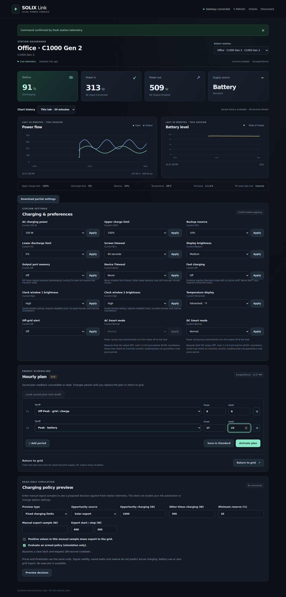
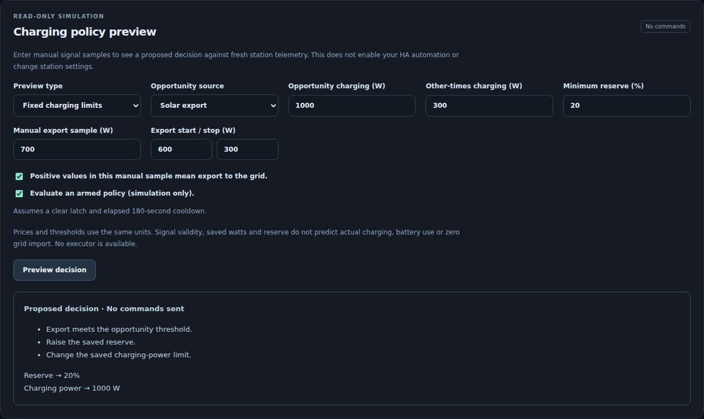
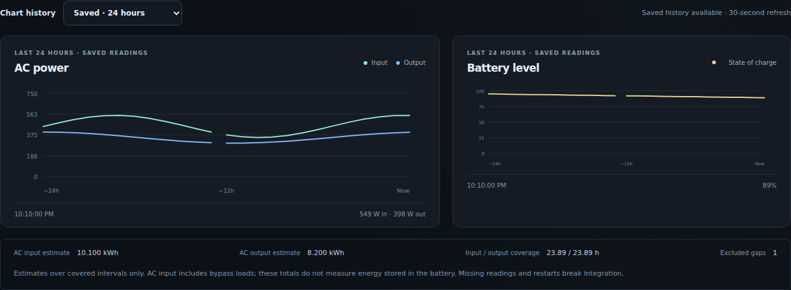

# Local web dashboard

The optional **Vue 3** dashboard is served by the **FastAPI/Uvicorn** gateway.
The Python package includes the compiled HTML, JavaScript and CSS: deployment
needs no Node installation, CDN or internet access. The original Web Bluetooth
app in `src/` remains a separate application.

## Run

```sh
python3 -m pip install './python[server,mqtt]'
# Load a generated token from your owner-only configuration.
export SOLIX_HTTP_TOKEN="$(cat /path/to/private/http-token)"
solix-link serve --config /path/to/config.json --web-ui --allow-control
```

For a station already connected to the isolated native MQTT service:

```sh
solix-link ap-service-serve --directory /path/to/private/ap-service \
  --web-ui --allow-control --host YOUR_LAN_ADDRESS --port 8765
```

The native worker must also have `--allow-control`. Without that flag, or
without gateway `--allow-control`, the dashboard is read-only. Writable gateway
startup requires a nonempty token. Open the gateway's `/` URL, enter the token,
and connect. An unprotected read-only gateway accepts an empty token.

The default bind is `127.0.0.1`. Use a trusted HTTPS reverse proxy when serving
beyond localhost. The station's isolated network and the gateway's LAN listener
are separate; serving this dashboard does not give the station internet access.

## Monitoring and controls

Select a station to see battery, input/output power, supply state, freshness
and history. The browser polls cached gateway status every five seconds;
it does not open another station connection. Session history stays in browser
memory for 30 minutes and resets on reload. To retain readings, start either
gateway with `--history-file /path/to/private/history/readings.sqlite3` and
optionally `--history-retention-days 7`. Saved 24-hour/seven-day views refresh
every 30 seconds. Missing/stale readings, outages and restarts produce gaps.
AC energy estimates include coverage and cannot measure stored battery energy;
see [storage and accounting semantics](persistent-history.md).

Native Gen 2 stations also have a **Charging policy preview** form. Enter manual
export/price samples and thresholds to evaluate cached status and see proposed
watts/reserve. Its armed checkbox is a simulation assumption; it never changes
HA helpers, enables automation or sends a setting. Positive-export confirmation
does not independently validate a sensor. There is no Apply action for proposals.
See [guards and request schema](charging-policy-preview.md).

The compiled dashboard also offers adaptive solar-surplus and price-driven
battery-use previews, simulated overrides/latch/cooldown and candidate-plan
explanations. These remain read-only. See [the adaptive contract](adaptive-policy-preview.md).

Controls follow the selected station's advertised capabilities. Each change
requires a review and explicit confirmation; offline or busy controls are
disabled. Charging settings and draft hourly tariff plans use the same strict
command API as the CLI and Home Assistant. Native C1000 Gen 2 also exposes
[verified temperature and off-grid alert settings](c1000-general-settings.md).
Its native profile now includes Low/Medium/High display brightness, screen
timeout (Never or 10/20/30/60/300/1800 seconds), and output port memory.
Port-memory Off clears recovery bookkeeping; turning On does not restore that
transient state. Each form requires valid fresh readback and explicit review.
See [tested values and restoration](c1000-native-preferences-validation.md);
other models and Gen 2 BLE brightness are unchanged.
The native brightness setter checks Standard/no active tariff and an inactive
clock screen before writing.
C1000 Gen 2 also has a guarded lower discharge limit; it cannot silently
adjust reserve. There is no HTTP AC-output switch. Several native stations can
share one AP: see [registration and selection](multiple-ap-devices.md).

The tariff editor is a **draft**. Fresh native Gen 2 saved-plan readback can
initialize it or be loaded explicitly; polling preserves edits. Plan freshness
is tracked separately from other telemetry. Older gateways show unavailable
readback rather than inventing hours. **Download partial settings** exports
sanitized cached preferences; it is incomplete and cannot restore a station.
See [readback/export semantics](settings-export-and-plan-readback.md).
Saving replaces the entire plan; activation persists on the station even after
closing the browser. Check the configured station timezone before choosing
hours. Return to grid requests confirmation from measured telemetry; it is not
an AC-output off command. A timeout can leave changed settings: inspect fresh
status before deciding whether to retry. The UI never retries a write.

## Authentication and API

The bundled shell and its exact asset paths are public and contain no station
telemetry. Status, history, charging-preview and command routes still
require the configured Bearer token. The browser keeps the token only in memory,
clears its input after connecting, and forgets it on disconnect or authentication
failure. It uses no local storage, cookies or token query parameters.

Existing JSON routes, SSE events, Prometheus metric names and the prepared HA
integration retain their contracts. The server implementation now uses FastAPI;
reinstall the `server` extra after upgrading from an older aiohttp-based build.
No Swagger/CDN routes are enabled. See [deployment and schemas](gateway-home-assistant.md).

## Develop

```sh
npm ci
npm run dev:dashboard    # Vite; proxies API requests to localhost:8765
npm run build:dashboard  # Vue type check, then bundled Python assets
PYTHONPATH=python python3 -m pytest python/tests home_assistant_tests -q
```

Install `pytest`, `httpx` and `aiohttp` to include gateway and standalone HA
contract tests. Vue sources live in `dashboard/`; commit both sources and the
built `python/solix_link/web/` assets after UI changes. `npm run build` still
checks the original Bluetooth application.

## Browser checks and screenshots

```sh
python3 -m pip install './python[server]'
npx playwright install chromium
npm run build:dashboard
npm run test:dashboard
```

For another interpreter/browser use `SOLIX_TEST_PYTHON=/path/to/python` and
`SOLIX_CHROMIUM_PATH=/path/to/chromium`. The checks start their own ephemeral
localhost fixture and use only simulated stations. They cover authentication,
write confirmation/cancellation, model capabilities, unsaved drafts, read-only
and stale states, command failure, disconnect races and mobile layout. They
cannot send a command to a real station. Screenshots are regenerated from
synthetic data:



[Mobile screenshot](images/web-dashboard-mobile.png).




